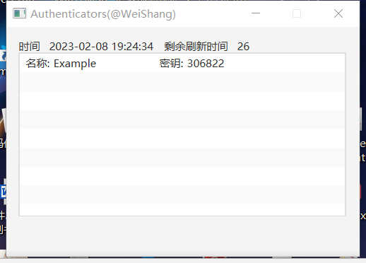

# 工程简介

1. 在Jar的同级目录下存在文件夹`spring-opt`，里面有文件`data.json`，这是OTPAuth参数，如下：

```json
[
  {
    "name": "Example",
    "uri": "otpauth://totp/Example:alice@gmail.com?secret=TGABZXEP4LKB46AX&issuer=Example"
  }
]
```

2. 启动软件后（存在JRE环境，直接双击Jar），界面如下：



里面的Token（或称之为密钥）是根据`1`中的配置而来的，如果您需要配置自己的OTP Token，请填写正确的`data.json`。

# 延伸阅读

[https://stackoverflow.com/questions/28057161/google-authenticator-missing-otpauth-protocol-parameter](https://stackoverflow.com/questions/28057161/google-authenticator-missing-otpauth-protocol-parameter)
